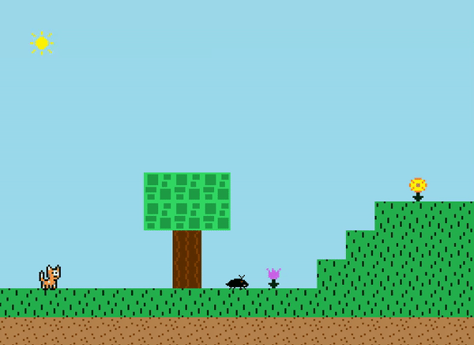
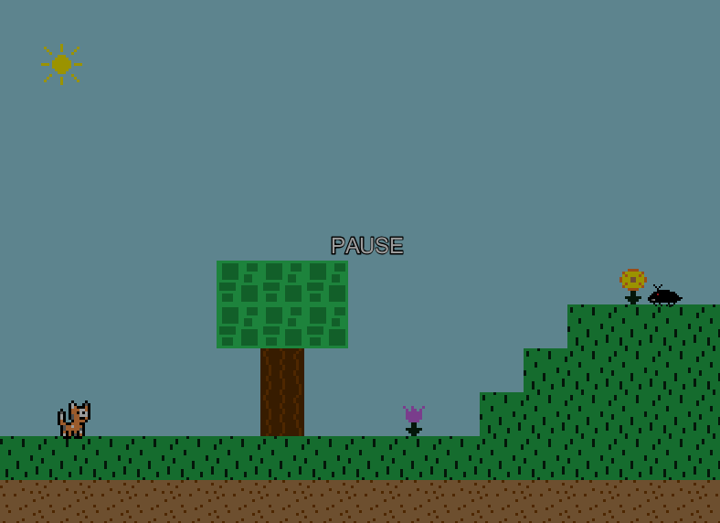
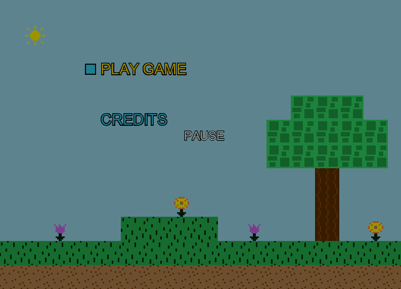

# Navigation Structure
{: .no_toc }

## Table of contents
{: .no_toc .text-delta }

1. TOC
{:toc}

---

# Bug Report

Below is a list of known bugs and oddities in the game code.
There are definitely more bugs than what is listed here...they just haven't been discovered yet.

## Map boundaries have no collisions

The player can walk off the edge of the map and will fall to their death with no way of getting back into the level. I uh...
kept meaning to fix this from day 1 and kept forgetting about it. 

It's hard to tell in the gif, but after running offscreen over the edge of the last tile in the map, there is no collision
stopping the player from falling.

Possible solutions for this is to either block the edge of every map with solid tiles (which looks really ugly and is a band-aid rather than a fix), or the better solution
would be to prevent the player from actually going off the edge (as if there is an invisible collision wall there). It could be as simple
as preventing the player's x location from being less than 0, and preventing the player's x2 location from being greater than the map's length
in pixels (I believe there's a method to check that in the `Map` class...).

## Pausing the game works from any screen

When the P key is pressed anywhere in the game, the game's `update` cycle will stop, which essentially halts the game, 
until the P key is pressed again. A large "PAUSE" text will appear at the center of the screen, and the background of the screen
will be tinted.

The pause game logic is included in the game engine's `GamePanel` class, which is the root of the game loop. This means
that it is active while any screen is loaded, including things like menu screen...which is definitely not ideal.

This is good.

This is not good.

The reason for this is that I originally made a simple version of this game engine for a class assignment (can be found [here](https://github.com/a-r-t/Simple-2D-Game-Engine)
that essentially had only one screen, so having the pause functionality be in that "global" space made sense. I never fixed it as I scaled the engine up, which is why
it now works everywhere.

I think the best course of action is moving the pause logic from the `GamePanel` over to something like the `PlayLevelScreen` which handles
the running of the actual level. Or maybe a better pause solution exists that I'm not thinking of.

## White color rgb(255,255,255) is transparent

I am not quite sure why this is, but if an image uses the color white with the rgb (255,255,255), the color will be
transparent when loaded in. I think it has to do with the way the `transformColorToTransparency` method works (which I lifted
from a StackOverflow answer) that I use in order to set a transparent color in an image when loading it in (the default transparent color
is magenta rgb (255,0,255)). Maybe there's a better transparency method out there that doesn't have this adverse effect on the color white?

The good news is this is super easy to work around -- just use a white color with a different rgb in your images, such as (255,255,254) (which will look
no different in game than (255,255,255) I promise). Off the top of my head, the `Walrus.png` image uses this technique for its tusks because
pure white wouldn't show, which is how I found out about this bug.

## Moving the player with arrow keys doesn't override previous key press properly

If you are holding the key to move the player to the right and then press left while holding the right key down still,
the left key overrides the right key and moves the player left. This is ideal. However, if holding the key to move the player to the left
and then press the right while holding the left key down still, the let key does not override the right key and player will
continue moving left. This is not ideal. For a more natural feel in a game that moves a player with keyboard input,
it's generally best to have both keys able to continually override each other.

This is not an arrow key specific thing -- this happens because the left key if statement check comes before the right key check,
so the right key is able to override the left key, but not vice versa.