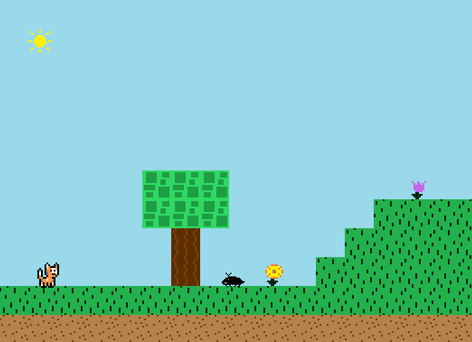
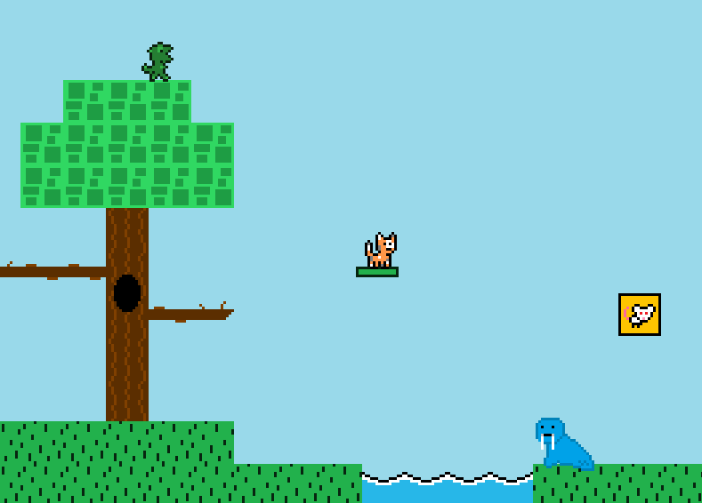

# Navigation Structure
{: .no_toc }

## Table of contents
{: .no_toc .text-delta }

1. TOC
{:toc}

---

# What is this game?

This game (which has no title as of now) is a traditional platformer where you play as a cat and have to traverse from the beginning to the end of 
a level while avoiding enemies. Upon hitting the gold box at the end of a level, the level is completed. Hitting an enemy results in a game over and the level must be restarted.

Inspiration for this game came from popular 2D platformers such as Mario and Megaman. The player currently can walk around, jump, and duck as standard to the genre,
and enemy/level design and graphics were heavily influenced by the games [Super Mario World](https://www.youtube.com/watch?v=ta7ufW0Prws) and [Megaman 2](https://www.youtube.com/watch?v=vuJ8Qr-3_zg).

The art direction was intended to create a "happy" vibe, and follows a blocky minimalistic style ~~because I am a horrible artist~~.
The sun shines, the flowers dance, and a bright color palette is used ~~which is totally not just the result of me only using Microsoft Paint default colors~~.

# Features

- One very short level
- Two enemy types
- One NPC that you can talk to
- Player can walk, jump, and duck
- Touching an enemy immediately kills you
- The level is completed when the gold box at the end of the level is touched
- Tile map loader that supports both static and animated tiles
- Some interesting level set pieces like jump through platforms and moving platforms
- A map editor tool
- A menu and credits screen

The menu screen can be navigated using the arrow keys and the space bar to select an option.

The player character (cat) can walk left and right using the left and right arrow keys. Pressing the up arrow key jumps, and pressing the down
arrow key ducks. Note that depending on the type of keyboard your computer has, you may be limited to how many keys you can press at the same time.
If you find yourself being unable to jump when multiple other arrow keys are pressed at once, it is a keyboard problem, not a coding/Java problem.

If you touch the gold box at the end of the level, the level will be completed. If you touch an enemy, you will die and be forced to restart the level. Most of the map tiles
(grass, dirt, trees) are solid and can be jumped on but not jumped through. There are a few tiles like the tree branches and the moving platform which
can be jumped through and stood on (like typical jump through platforms that are common in the platforming genre).

Clearly, this game is not finished, in fact it's pretty much just the "start" of a platformer game. There is one level, two enemy types (that cannot be killed in any way),
and the player character's movement options are limited. There are many different directions the game can be taken in from here,
and the backing game engine was built to support a wide variety of options that could be feasibly implemented.

# Tools used to make this game

This game was written in Java (version 8 or later) and uses no external libraries. It was developed using the IntelliJ IDE,
although it should work out of the box with any other Java IDEs such as Eclipse. 

All of the game's art was created from scratch using the almighty Microsoft Paint.

# Running the game

The game can be run like any other Java application by executing the program starting from the file with the main method. I recommend using
the IntelliJ IDE to run the application, however the Eclipse IDE will work fine as well.

The `main` method for the game is in the `Game` package > `Game.java` file.

The `main` method for the map editor is in the `MapEditor` package > `MapEditor.java` file. This is a separate program
from the game.

# Game Screenshots

Here is what the game looks like:

Menu Screen

In Game Screens (the player character is the adorable cat!)

